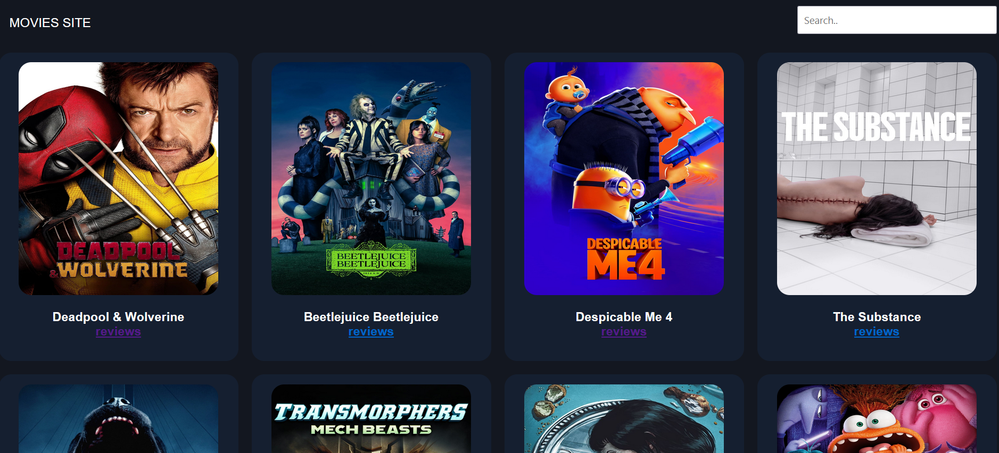
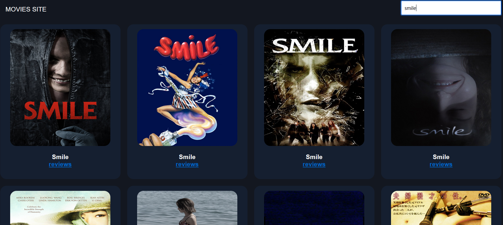
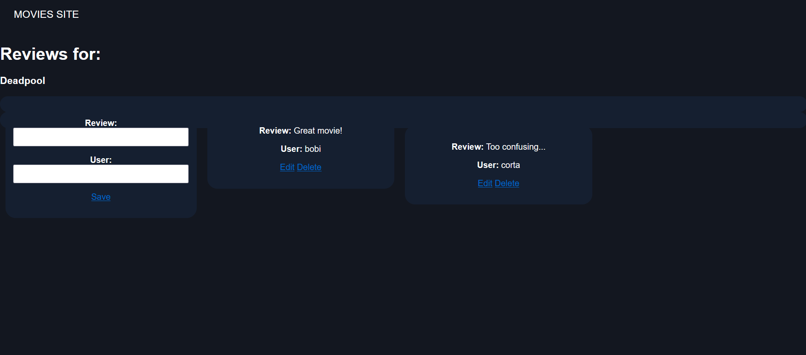

# •	Movie Search and Review App
Full-stack web application containing a front-end movie search app using The Movie Database API and a back-end API to create movie reviews and save them in a MongoDB database.

 

 

 

## Technologies used:

* HTML
* CSS
* JavaScript
* Node.js
* MongoDB
* API

## Credits:

This is a project I made based on Tomi Tokko's and Beau Carnes' course on [Full Stack Web Development for Beginners](https://www.youtube.com/watch?v=nu_pCVPKzTk).
